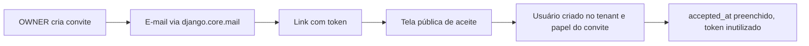

# accounts — autenticação e usuários

App responsável pelo model `User`, pelos papéis, pelo fluxo de autenticação e pelos convites.

## Login por e-mail

O `User` herda de `AbstractBaseUser` + `PermissionsMixin` e **não possui campo `username`**:

```python
USERNAME_FIELD = 'email'
REQUIRED_FIELDS = ['full_name']
```

O `UserManager` (`accounts/managers.py`) cria usuários por e-mail, normalizando o domínio. `create_superuser` grava `tenant=None` e `role=''` — o superusuário opera entre corretoras.

## Papéis

Definidos em `base.constants.Role`, para que tanto o model quanto o `RolePermissionMixin` possam importá-los sem ciclo:

| Papel | Código | Visibilidade |
| --- | --- | --- |
| Dono / Admin | `OWNER` | Todos os dados do tenant |
| Agente | `AGENT` | Próprios e dos produtores vinculados |
| Produtor | `PRODUCER` | Apenas os próprios |

`User.clean()` exige tenant **e** papel de todo usuário não superusuário. É essa regra que garante que o `TenantMiddleware` nunca encontre um usuário que não consiga posicionar.

## TenantMiddleware com o campo `tenant` ativo

Desde a Sprint 1 o middleware checava `user_model_has_tenant()` e se abstinha, porque o `auth.User` padrão não tinha o campo. Com o `accounts.User` em vigor a checagem passa a retornar `True` e a regra ativa **sozinha**, sem alteração de código.

A ordem das guardas em `resolve_tenant` é o que impede a regressão óbvia:

```python
if not user.is_authenticated:  return None   # anônimo
if user.is_superuser:          return None   # ANTES de olhar tenant
if not user_model_has_tenant():return None   # rede de segurança
if tenant is None or not tenant.is_active:
    logout(request)                          # desloga
```

O `is_superuser` retorna antes de qualquer checagem de corretora — por isso o superusuário sem tenant continua entrando no admin normalmente.

Comportamento verificado:

| Usuário | `request.tenant` | Resultado |
| --- | --- | --- |
| Anônimo | `None` | segue para o login |
| Superusuário | `None` | acessa o admin (HTTP 200) |
| Usuário de corretora ativa | a corretora | acessa normalmente |
| Usuário de corretora inativa | `None` | **deslogado** |

## Rotas

Todas sob o prefixo `/conta/`:

| Rota | View | Acesso |
| --- | --- | --- |
| `entrar/` | `EmailLoginView` | Público |
| `sair/` | `AppLogoutView` | Autenticado |
| `perfil/` | `ProfileView` | Autenticado |
| `senha/redefinir/…` | Views nativas do Django | Público |
| `usuarios/` | `UserListView` | **OWNER** |
| `usuarios/novo/` | `UserCreateView` | **OWNER** |
| `usuarios/<pk>/editar/` | `UserUpdateView` | **OWNER** |
| `convites/novo/` | `InvitationCreateView` | **OWNER** |
| `convite/<token>/` | `InvitationAcceptView` | Público (ainda não tem conta) |

O `OwnerRequiredMixin` compõe o `TenantRequiredMixin` e levanta `PermissionDenied` para quem não for `OWNER`. As querysets de usuário filtram por `tenant=request.tenant`, então editar usuário de outra corretora retorna **404**.

## Convites

`Invitation` guarda tenant, e-mail, papel, token (`secrets.token_urlsafe(32)`), validade de 7 dias e `accepted_at`.



Uma `UniqueConstraint` condicional impede dois convites **pendentes** para o mesmo e-mail no mesmo tenant, sem bloquear um novo convite depois que o anterior foi aceito.

## E-mail

Backend nativo (`django.core.mail`), credenciais do `.env`. Com `DEBUG=True` e `EMAIL_HOST` vazio, as mensagens vão para o console. Todos os templates estão em português, em `accounts/templates/accounts/email/`.

A recuperação de senha usa as views nativas do Django ponta a ponta e **não revela** se o e-mail existe: a tela de confirmação é a mesma nos dois casos.

## Estado da implementação

Os templates usam um layout mínimo (`base/templates/base/layouts/auth.html`) com os tokens reais do design system inline. A Sprint 3 substitui esse bloco pelo bundle Tailwind e pelos componentes definitivos.
