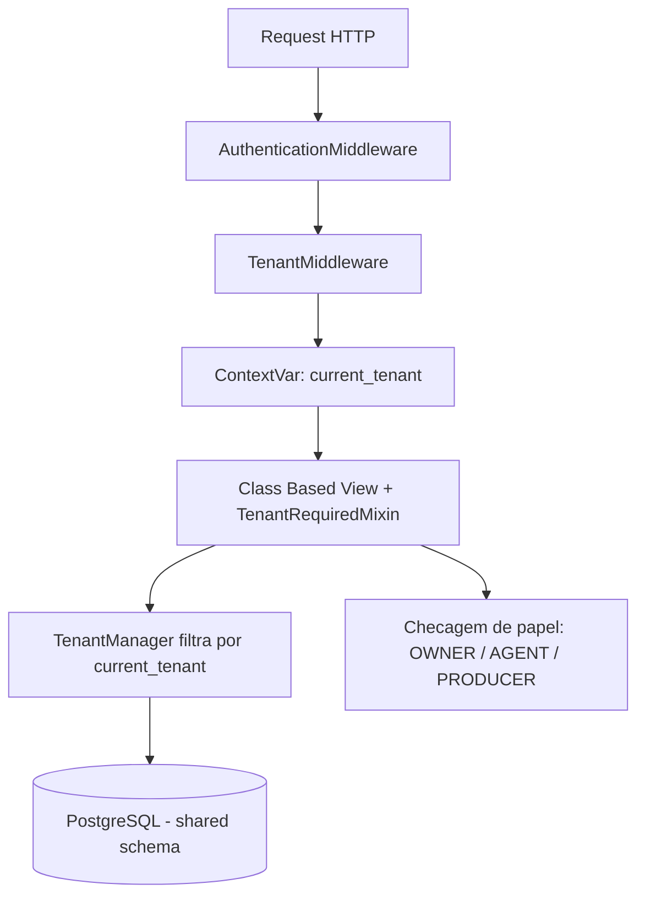
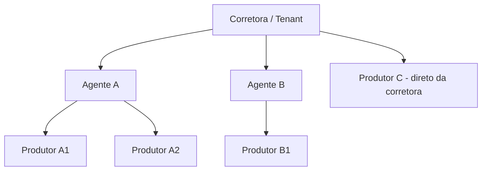

# Arquitetura multi-tenant

O SCSI usa **exclusivamente** o modelo de **schema compartilhado**: um único banco PostgreSQL, um único schema, e uma coluna `tenant_id` em toda tabela de domínio.

| Aspecto | Decisão |
| --- | --- |
| Banco | Único, compartilhado |
| Schema | Único (`public`) |
| Discriminador | Coluna `tenant_id` (FK para `core.Tenant`) |
| Isolamento | Manager/QuerySet + middleware + permissões |
| Migrações | Uma execução única de `migrate` para todos os tenants |

Nunca schema por tenant, nunca banco por tenant.

## Camadas de isolamento



1. **Middleware** — `base.middleware.TenantMiddleware` resolve o tenant a partir de `request.user.tenant`, publica em um `ContextVar` e anexa como `request.tenant`.
2. **Manager e QuerySet** — `TenantManager` (o `objects` padrão) filtra automaticamente pelo tenant corrente. O manager irrestrito `all_tenants` existe apenas para admin de superusuário, management commands e tools de IA que passam `tenant_id` explícito — **nunca em views**.
3. **Model abstrato** — `base.models.TenantAwareModel` injeta a FK `tenant` e herda os campos de auditoria de `TimeStampedModel`.
4. **Views** — CBVs herdam `TenantRequiredMixin`; o tenant é atribuído no `form_valid` e **nunca** aceito pelo POST.
5. **Permissões por papel** — sobre o filtro de tenant aplica-se o escopo do papel.

## Escopo por papel

| Papel | Visibilidade |
| --- | --- |
| `OWNER` | Todos os dados do tenant |
| `AGENT` | Dados próprios e dos produtores vinculados |
| `PRODUCER` | Apenas os dados de que é proprietário |

## Hierarquia comercial



`Producer.agent` é **nullable**: um produtor pode reportar diretamente à corretora. A comissão é paga pela seguradora à corretora, que repassa a agente e/ou produtor conforme regras configuráveis.

## Integridade

- Toda FK entre entidades de domínio é validada no `clean()` para garantir que ambos os lados pertencem ao mesmo tenant.
- Índices compostos `(tenant_id, <campo>)` em todos os campos usados em filtros e ordenações.
- Unicidade sempre escopada: `UniqueConstraint(fields=['tenant', 'document'])`.

## Onde cada camada mora

| Camada | Arquivo | Símbolo |
| --- | --- | --- |
| ContextVar | `base/context.py` | `get_current_tenant`, `tenant_context` |
| Manager | `base/managers.py` | `TenantQuerySet`, `TenantManager` |
| Model abstrato | `base/models.py` | `TenantAwareModel` |
| Middleware | `base/middleware.py` | `TenantMiddleware` |
| Mixins | `base/mixins.py` | `TenantRequiredMixin`, `RolePermissionMixin` |
| Papéis | `base/constants.py` | `Role` |
| Raiz do tenant | `core/models.py` | `Tenant`, `Plan` |

## O manager falha fechado

Sem tenant em contexto, `objects` devolve **queryset vazio** — não a tabela inteira.
É a escolha deliberada: um middleware esquecido ou uma query fora de request retorna
nada, nunca dados de outra corretora.

```python
Policy.objects.count()          # 0 fora de request
with tenant_context(alpha):
    Policy.objects.count()      # apenas as da Alpha
Policy.all_tenants.count()      # todas, uso restrito
```

`Meta.base_manager_name = 'all_tenants'` aponta os internos do Django (descritores de
relação, `refresh_from_db`) para o manager irrestrito, para que o framework não tropece
no filtro. O `_default_manager` — usado por views, forms e admin — continua sendo o
filtrado.

## Validação cross-tenant

`TenantAwareModel.clean()` percorre as FKs que apontam para outros models tenant-aware
e recusa qualquer uma cujo tenant divirja:

```
Claim(tenant=alpha, policy=<apólice da Beta>).full_clean()
→ ValidationError: {'policy': ['Este registro pertence a outra corretora.']}
```

## Estado da implementação

Sprint 1 entregou as cinco camadas, o `Tenant`, o `Plan` e o admin dos dois. O
`TenantMiddleware` só passa a deslogar usuário sem corretora quando o model `User`
ganhar o campo `tenant`, na Sprint 2 — até lá ele resolve tenant nenhum e não
interfere no login do admin.

O `RolePermissionMixin` depende de `user.role` e dos perfis `agent_profile` /
`producer_profile`, que chegam nas Sprints 2 e 6. Enquanto não existirem, o mixin
está escrito mas não tem model de domínio onde ser aplicado.
