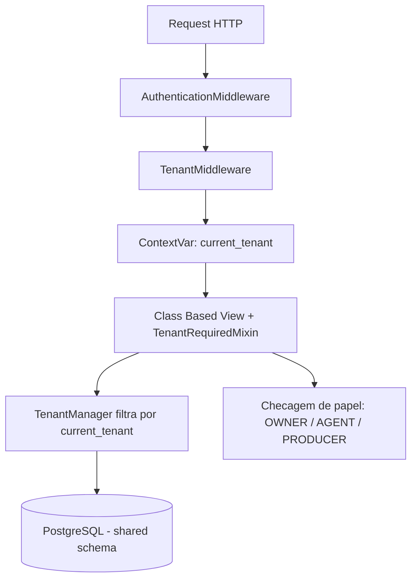
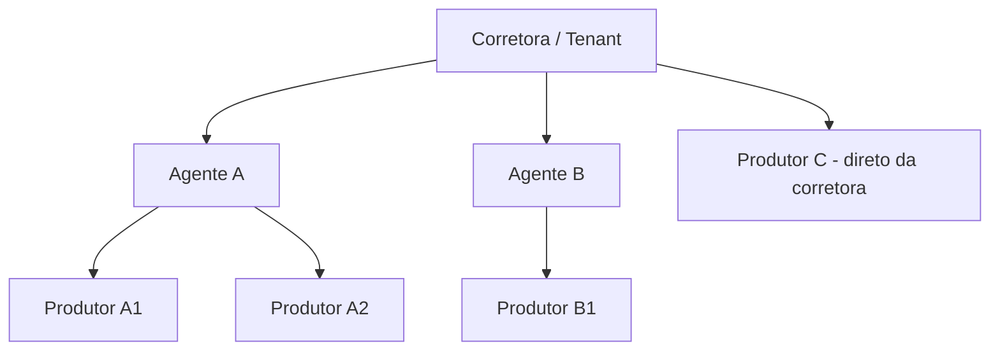

# Arquitetura multi-tenant

O SCSI usa **exclusivamente** o modelo de **schema compartilhado**: um único banco PostgreSQL, um único schema, e uma coluna `tenant_id` em toda tabela de domínio.

| Aspecto | Decisão |
| --- | --- |
| Banco | Único, compartilhado |
| Schema | Único (`public`) |
| Discriminador | Coluna `tenant_id` (FK para `core.Tenant`) |
| Isolamento | Manager/QuerySet + middleware + permissões |
| Migrações | Uma execução única de `migrate` para todos os tenants |

Nunca schema por tenant, nunca banco por tenant.

## Camadas de isolamento

1. **Middleware** — `base.middleware.TenantMiddleware` resolve o tenant a partir de `request.user.tenant`, publica em um `ContextVar` e anexa como `request.tenant`.
2. **Manager e QuerySet** — `TenantManager` (o `objects` padrão) filtra automaticamente pelo tenant corrente. O manager irrestrito `all_tenants` existe apenas para admin de superusuário, management commands e tools de IA que passam `tenant_id` explícito — **nunca em views**.
3. **Model abstrato** — `base.models.TenantAwareModel` injeta a FK `tenant` e herda os campos de auditoria de `TimeStampedModel`.
4. **Views** — CBVs herdam `TenantRequiredMixin`; o tenant é atribuído no `form_valid` e **nunca** aceito pelo POST.
5. **Permissões por papel** — sobre o filtro de tenant aplica-se o escopo do papel.

## Escopo por papel

| Papel | Visibilidade |
| --- | --- |
| `OWNER` | Todos os dados do tenant |
| `AGENT` | Dados próprios e dos produtores vinculados |
| `PRODUCER` | Apenas os dados de que é proprietário |

## Hierarquia comercial

`Producer.agent` é **nullable**: um produtor pode reportar diretamente à corretora. A comissão é paga pela seguradora à corretora, que repassa a agente e/ou produtor conforme regras configuráveis.

## Integridade

- Toda FK entre entidades de domínio é validada no `clean()` para garantir que ambos os lados pertencem ao mesmo tenant.
- Índices compostos `(tenant_id, <campo>)` em todos os campos usados em filtros e ordenações.
- Unicidade sempre escopada: `UniqueConstraint(fields=['tenant', 'document'])`.

## Estado da implementação

Sprint 0 entregou apenas `TimeStampedModel`. As demais camadas (`Tenant`, `TenantAwareModel`, `TenantManager`, `TenantMiddleware`, mixins) são a Sprint 1.
