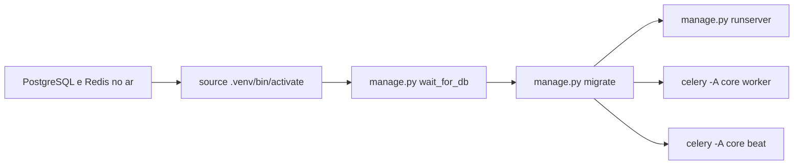

# Ambiente local

Todo o ambiente roda **nativamente**, sem containers. O projeto Django executa dentro do `.venv` na raiz do repositório.

## Serviços

| Serviço | Papel | Porta | Estado neste ambiente |
| --- | --- | --- | --- |
| PostgreSQL 16 | Banco de dados | 5432 | Nativo — Postgres.app |
| Redis 7.4 | Cache, broker e result backend do Celery | 6379 | Nativo — compilado do source |

!!! note "Redis acumula três papéis"
    O RabbitMQ foi removido do escopo do projeto. O Celery usa **Redis como broker e como result backend**, em databases distintos para que mensagens enfileiradas e resultados nunca compartilhem keyspace:

    | Database | Papel | Variável |
    | --- | --- | --- |
    | `0` | Broker do Celery | `CELERY_BROKER_URL` |
    | `1` | Result backend | `CELERY_RESULT_BACKEND` |
    | `2` | Cache da aplicação | `REDIS_CACHE_URL` |

!!! note "Por que o Homebrew não é usado aqui"
    Este ambiente roda **macOS 12.7.6 (Monterey)**, que o Homebrew não suporta mais: não há bottles pré-compiladas, então toda fórmula compila do source. Por isso o PostgreSQL vem do Postgres.app e o Redis é compilado — um build curto, sem dependências externas.

## Instalação dos serviços

### PostgreSQL — Postgres.app

O Homebrew não serve neste macOS, então usamos o Postgres.app, que distribui binários prontos.

```bash
# Baixe o Postgres.app com PostgreSQL 16 (última linha que suporta Monterey)
curl -L -o /tmp/pg16.dmg \
  https://github.com/PostgresApp/PostgresApp/releases/download/v2.8.5/Postgres-2.8.5-16.dmg

hdiutil attach -nobrowse /tmp/pg16.dmg
cp -R /Volumes/Postgres/Postgres.app /Applications/
hdiutil detach /Volumes/Postgres
xattr -dr com.apple.quarantine /Applications/Postgres.app
```

Inicialize o cluster e suba o servidor sem abrir a GUI:

```bash
export PGBIN=/Applications/Postgres.app/Contents/Versions/16/bin
export PGDATA="$HOME/Library/Application Support/Postgres/var-16"

$PGBIN/initdb -D "$PGDATA" --encoding=UTF8 --locale=en_US.UTF-8 -U "$USER"
$PGBIN/pg_ctl -D "$PGDATA" -l "$HOME/Library/Logs/Postgres/server-16.log" -o "-p 5432" -w start
$PGBIN/pg_isready -p 5432
```

Crie o banco e o usuário da aplicação:

```bash
$PGBIN/psql -p 5432 -d postgres <<'SQL'
CREATE ROLE scsi WITH LOGIN PASSWORD 'sua-senha-aqui' CREATEDB;
CREATE DATABASE scsi OWNER scsi ENCODING 'UTF8';
SQL
```

Para parar: `$PGBIN/pg_ctl -D "$PGDATA" stop`.

### Redis — compilado do source

O Redis não tem dependências externas; o build leva cerca de um minuto.

```bash
curl -sL -o /tmp/redis.tar.gz https://download.redis.io/releases/redis-7.4.2.tar.gz
tar xzf /tmp/redis.tar.gz -C /tmp
make -C /tmp/redis-7.4.2 -j4 MALLOC=libc
make -C /tmp/redis-7.4.2 install PREFIX=$HOME/.local
```

Configuração em `~/.local/etc/redis.conf`:

```
port 6379
bind 127.0.0.1
daemonize yes
dir /Users/SEU_USUARIO/.local/var/redis
logfile /Users/SEU_USUARIO/.local/var/redis/redis.log
save 900 1
```

```bash
mkdir -p ~/.local/var/redis
~/.local/bin/redis-server ~/.local/etc/redis.conf
~/.local/bin/redis-cli ping   # PONG
```

Para parar: `~/.local/bin/redis-cli shutdown`.

## Projeto Django

```bash
python3.13 -m venv .venv
source .venv/bin/activate
pip install -r requirements.txt

cp .env.example .env      # preencha os valores
```

Ordem de inicialização:



```bash
python manage.py wait_for_db
python manage.py check_services
python manage.py migrate
python manage.py createsuperuser
python manage.py runserver
```

Em terminais separados, sempre com o `.venv` ativado:

```bash
celery -A core worker -l info
celery -A core beat -l info
```

## Verificação

```bash
curl -i http://127.0.0.1:8000/health/     # 200 {"status": "ok"}
python manage.py check_services            # PostgreSQL / Redis / broker do Celery
```

O `check_services` imprime o estado de cada dependência e nunca vaza credenciais — as URLs são exibidas sem usuário e senha.

## Documentação

```bash
mkdocs serve -a 127.0.0.1:8001
```
